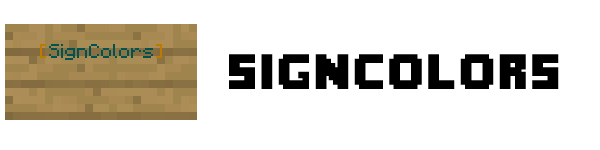

# Introduction

SignColors is a Spigot plugin that allows all players on the server (or people with permissions)
to add colored text to signs.
Simply use the `&` character (this is configurable) followed by a hexidecimal digit (`0-f`)
to give the rest of the line a color and/or a format.

## Features

- Players can add colors/formats to signs.
- Permissions per color/format.
- Use your own color symbol instead of `&`.
- Possibility to craft colored signs (recipe and type are configurable).
- Introduces a special sign (so called `[SC]` sign) that allows players to buy signs where colors/formats are possible (requires [Vault](https://www.spigotmc.org/resources/vault.34315/)).
  - If this feature is enabled, you can only write colors/formats on an specific crafted/bought sign.
  - Players get crafted colored signs back, if they destroy them.
  - Database of placed colored signs is supported via SQLite or MySQL.
  - Certain first lines on signs can be blocked (like `&1[Buy]` from Essentials) to avoid unwanted abuse.
- Automatically checks for updates (configurable).
- English and German translations provided and additional can be added manually.
- May send metrics (configurable).
