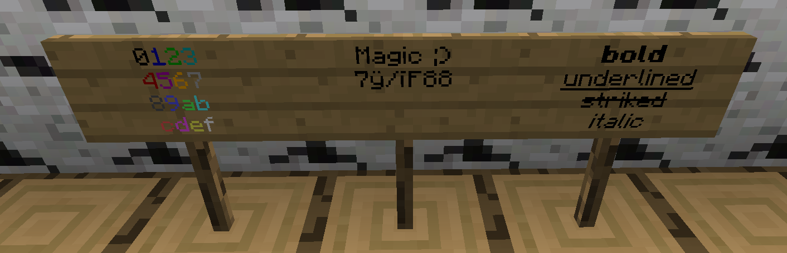

# Usage

This page provides useful information on how to use the plugin's features.

## How to add colors/formats to signs?

To create a colored/formatted sign, write the colorcode (default is: `&`) and one of the following characters
(`0, 1, 2 ,3, 4, 5, 6, 7, 8, 9, a, b, c, d, e, f, k, l, m, n, o, r`) in front of your text.
Of course you can write more than one color in one line.

The image below demonstrates all possible colors and formats:

## How to create a `[SC]` sign?

Create a sign with the following content:

| Line          | Text                 |
|---------------|----------------------|
| 1. (required) | `[SignColors]`       |
| 2. (optional) | `<amount> : <price>` |

Replace `<amount>` and `<price>` with your values.
If you leave them out, the default values from config will be used.
The rest is created automatically. An example sign could look like this:

![Example of a [SC] sign before placing it](images/sc_sign_before.png)

After placing the sign, it will look like this:

![Example of a [SC] sign after placing it](images/sc_sign_after.png)

Now players can right click on the sign and will get **10** colored signs for **100 $**.
